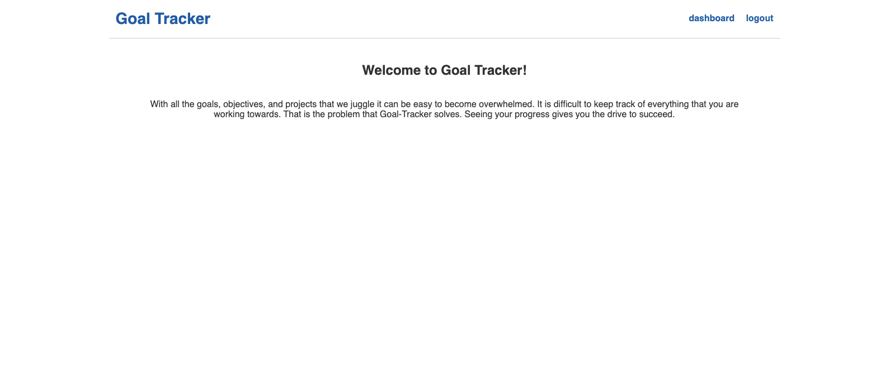
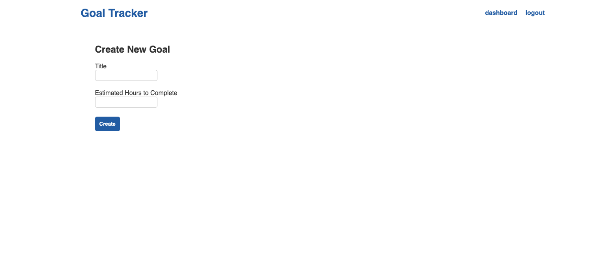

# Goal Tracker App
  
## Description

Goal Tracker is an application that lets users document their goals and track their progress toward achieving them.

## Table of Contents

* [Installation](#installation)
 * [Usage](#usage)
 
 * [Tests](#tests)
 * [Questions](#questions)

## Installation Instructions

After cloning from the repository, install the following dependencies from the terminal: express, sequelize, mysql2, bcrypt, email.js, and handlebars.

## Usage

After creating an account and signing in, you will be taken to a dashboard where you will create a list of goals. Each goal will have an edit option where you can log the amount of hours you have spent toward the goal. 

## Tests

Jest

## License

This application is licensed under MIT

## Questions

If you have any questions, email me at amalagon251@gmail.com

Github: github.com/amalagon1